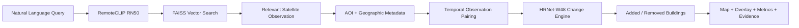

<div align="center">

# 🛰️ ORBITRACE

### Semantic Retrieval & Multi-Temporal Change Intelligence for Satellite Imagery

**Search satellite imagery with natural language. Discover the right AOI. Compare dates. Detect urban change. Generate geospatial evidence.**


</div>

---

## 🌍 About ORBITRACE

**ORBITRACE** is an AI-powered satellite intelligence platform designed for:

- semantic satellite-image retrieval
- multi-temporal observation analysis
- geospatial metadata extraction
- urban/building change detection
- evidence generation

Instead of manually searching large satellite archives, a user can simply ask:

> **“Find regions showing new construction near dense urban areas.”**

ORBITRACE retrieves relevant satellite imagery and connects it with temporal observations and change-analysis results.

---

# ⚡ Core Pipeline



---

# 🧠 AI Architecture

## 1. RemoteCLIP — Semantic Retrieval

RemoteCLIP understands both:

```text
TEXT
+
SATELLITE IMAGE
```

inside a shared embedding space.

Example query:

```text
forest with winding roads
```

Pipeline:

```text
Query
   ↓
RemoteCLIP
   ↓
Text Embedding
   ↓
Similarity Search
   ↓
Satellite Image Embeddings
```

This enables retrieval based on **meaning instead of filename or manually assigned tags**.

---

## 2. FAISS — Fast Vector Search

Satellite-image embeddings are generated once and stored inside a FAISS index.

```text
Satellite Images
       ↓
RemoteCLIP
       ↓
Image Embeddings
       ↓
FAISS Index
       ↑
Text Embedding
```

This allows ORBITRACE to scale semantic retrieval to large satellite archives.

---

## 3. HRNet-W48 — Building Change Intelligence

For built-up / construction analysis, ORBITRACE uses a SpaceNet-7 domain-specific HRNet-W48 branch.

Current frozen POC configuration:

```text
Model              : SpaceNet-7 lxastro0 HRNet-W48
Image Scale        : 3×
Patch Size         : 512 × 512
Patch Overlap      : None
Building Threshold : 0.35
Minimum Component  : 100 pixels
```

The change engine can derive:

```text
Persistent Buildings
Added Buildings
Removed Buildings
Change Mask
Change Overlay
Pixel Statistics
```

---

# 📊 Validation Snapshot

## Development AOI

```text
L15-1669E-1160N_6679_3549_13
```

| Metric | Added Building Detection |
|---|---:|
| Precision | 0.4626 |
| Recall | 0.6137 |
| F1 Score | **0.5276** |
| IoU | **0.3583** |

---

## Unseen AOI

```text
L15-1615E-1206N_6460_3366_13
```

Using the **same frozen configuration without retuning**:

| Metric | Added Building Detection |
|---|---:|
| Precision | 0.4598 |
| Recall | 0.6170 |
| F1 Score | **0.5269** |
| IoU | **0.3577** |

> These are limited POC validation results and should not be interpreted as production-grade accuracy.

---

# 🗺️ Geospatial Intelligence

ORBITRACE extracts geographic information directly from GeoTIFF imagery using Rasterio.

Example metadata:

```json
{
  "aoi_id": "L15-1670E-1159N_6681_3552_13",
  "date": "2018_09",
  "crs": "EPSG:3857",
  "latitude": 23.2211,
  "longitude": 113.6206,
  "city": "Guangzhou City",
  "state": "Guangdong",
  "country": "China"
}
```

The platform can therefore return:

```text
Satellite Image
+
Observation Date
+
AOI
+
Latitude / Longitude
+
City / State / Country
+
Change Evidence
```

---

# 🧪 Current Mini Integration Archive

Current system-level testing uses:

```text
3 AOIs
×
2 observations each
=
6 GeoTIFF satellite observations
```

Heavy satellite data is intentionally stored outside the Git repository:

```text
C:\ORBITRACE_DATA
```

Example:

```text
C:\ORBITRACE_DATA
│
├── mini_archive
├── mini_previews
├── mini_catalog.json
├── mini_catalog.csv
│
└── hrnet
    ├── development
    └── local_validation
```

---

# 🏗️ Project Structure

```text
satellite-poc/
│
├── core/
│   ├── semantic_search.py
│   ├── faiss_index.py
│   ├── geospatial.py
│   ├── pipeline.py
│   └── change_detection*.py
│
├── ORBITRACE/
│
│   ├── backend/
│   │   ├── api/
│   │   ├── semantic_search/
│   │   ├── change_detection/
│   │   ├── geospatial/
│   │   └── services/
│   │
│   ├── config/
│   ├── data/
│   ├── frontend/
│   ├── models/
│   ├── outputs/
│   │
│   └── scripts/
│       ├── build_mini_catalog.py
│       ├── test_mini_semantic.py
│       └── test_hrnet_local.py
│
├── images/
├── integration_data/
│
└── README.md
```

---

# 🔎 Example ORBITRACE Workflow

User enters:

```text
Find areas with recent construction near urban regions
```

ORBITRACE executes:

```text
Natural Language Query
        ↓
RemoteCLIP
        ↓
Text Embedding
        ↓
FAISS
        ↓
Relevant Satellite Scene
        ↓
AOI Identification
        ↓
Geographic Metadata
        ↓
Available Temporal Observations
        ↓
T1 / T2 Pairing
        ↓
HRNet-W48
        ↓
Added / Removed Buildings
        ↓
Change Overlay
        ↓
Evidence + Location + Metrics
```

---

# ✨ Current Capabilities

| Capability | Status |
|---|---|
| Natural-language satellite search | ✅ |
| RemoteCLIP RN50 | ✅ |
| Semantic ranking | ✅ |
| FAISS retrieval | ✅ POC |
| GeoTIFF processing | ✅ |
| CRS extraction | ✅ |
| Lat/Lon extraction | ✅ |
| Reverse geocoding | ✅ |
| English location metadata | ✅ |
| RGB preview generation | ✅ |
| Multi-date AOI catalog | ✅ |
| HRNet-W48 probability maps | ✅ |
| Added building mask | ✅ |
| Removed building mask | ✅ |
| Change overlay | ✅ |
| Local HRNet adapter | ✅ |
| Automatic T1/T2 pairing | 🚧 |
| Unified pipeline | 🚧 |
| Backend APIs | 🚧 |
| Web dashboard | 🚧 |

---

# 🏆 Winner-Level Intelligence Features

These features are part of the locked ORBITRACE roadmap.

## 1. Earliest Evidence Discovery

Instead of simply comparing two dates, ORBITRACE will scan the observation timeline.

```text
2017_07 → No Change
2017_08 → No Change
2017_09 → Possible Change
2017_10 → Confirmed Development
```

Result:

```text
Earliest Reliable Evidence:
October 2017
```

---

## 2. Evidence Timeline

Each AOI will have a temporal evidence timeline.

```text
2017 ───── 2018 ───── 2019 ───── 2020
  ●          ●     ●       ●
```

This allows analysts to understand **how a location evolved through time**.

---

## 3. Explainable Semantic Search

Instead of returning only:

```text
Similarity Score: 0.82
```

ORBITRACE aims to explain why the result matched.

Example:

```text
Matched Concepts

✓ Dense Buildings
✓ Forested Terrain
✓ Developing Road Network
```

---

## 4. Change Reliability Gate

Before accepting change results, ORBITRACE can verify imagery quality.

```text
Registration Quality        GOOD
Cloud Obstruction           LOW
Temporal Compatibility      GOOD
Change Confidence           HIGH
```

If the imagery pair is unreliable:

```text
Analysis Withheld

Reason:
Cloud obstruction / registration mismatch
```

---

## 5. Evidence Card / Investigation Report

Each change event can generate a structured evidence report.

Example:

```text
ORBITRACE EVENT #0042

Location:
Guangzhou City, Guangdong, China

AOI:
L15-1670E-1159N_6681_3552_13

Observation T1:
September 2018

Observation T2:
September 2019

Detected:
New Built-Up Development

Change Confidence:
High

Model:
HRNet-W48

Data Source:
SpaceNet-7
```

The report can later contain:

```text
Before Image
After Image
Change Mask
Overlay
Map
Coordinates
Area Changed
Change Percentage
Model Parameters
```

---

# 💡 Future Capability — Similar Site Discovery

Once ORBITRACE detects an interesting change event:

```text
Find Similar Changes
```

The system can search the indexed satellite archive for other locations showing similar development patterns.

This combines:

```text
Semantic Retrieval
+
Temporal Change Intelligence
```

---

# 📦 Dataset Strategy

Current primary satellite source:

## SpaceNet-7

Accessible public archive inspected during development:

```text
Training AOIs     : 60
Public Test AOIs  : 20
-----------------------
Accessible AOIs   : 80
```

The architecture is designed so scaling from:

```text
3 AOIs
```

to:

```text
80+ AOIs
Thousands of Observations
```

requires batch processing rather than rewriting the application.

---

# 🚀 Quick Start

## 1. Create Environment

```powershell
py -3.11 -m venv .venv
.\.venv\Scripts\Activate.ps1
```

---

## 2. Install Core Dependencies

```powershell
pip install torch torchvision
pip install open-clip-torch
pip install faiss-cpu
pip install rasterio
pip install pillow
pip install numpy
```

---

## 3. Build Satellite Metadata Catalog

```powershell
cd ORBITRACE

python scripts\build_mini_catalog.py
```

Expected:

```text
CATALOG COMPLETE

Images: 6
AOIs: 3
```

---

## 4. Test Semantic Search

```powershell
python scripts\test_mini_semantic.py "forest with winding roads"
```

The system returns ranked satellite observations with:

```text
Similarity Score
AOI
Date
City
State
Country
```

---

## 5. Test HRNet Local Change Analysis

```powershell
python scripts\test_hrnet_local.py
```

Outputs include:

```text
probability_2017.png
probability_2019.png

built_2017_mask.png
built_2019_mask.png

added_buildings.png
removed_buildings.png

final_change_overlay.png

summary.json
```

---

# 🛠️ Technology Stack

| Layer | Technology |
|---|---|
| Vision-Language Model | RemoteCLIP RN50 |
| Vector Search | FAISS |
| Change Detection | HRNet-W48 |
| Satellite Dataset | SpaceNet-7 |
| Geospatial Processing | Rasterio |
| Image Processing | Pillow |
| Numerical Processing | NumPy |
| ML Runtime | PyTorch |
| Metadata | JSON / CSV |
| Database | SQLite planned |
| API | FastAPI planned |
| Frontend | Web dashboard |

---

# 🔐 Repository Policy

Heavy datasets and model artifacts should **not** be pushed to GitHub.

```gitignore
.venv/
__pycache__/
*.pyc

.env
.env.*

*.pt
*.pth
*.ckpt

*.npy
*.tif
*.tiff

external/
dataset/
outputs/
ORBITRACE/outputs/
```

Raw satellite imagery and generated ML outputs are stored locally.

```text
C:\ORBITRACE_DATA
```

---

# 📌 Development Status

```text
RemoteCLIP Semantic Retrieval      ✅
        ↓
Geospatial Catalog                 ✅
        ↓
3 AOI System Test                  ✅
        ↓
HRNet Local Adapter                ✅
        ↓
FAISS Final Index                  🚧
        ↓
Automatic T1/T2 Pairing            🚧
        ↓
Unified ORBITRACE Pipeline         🚧
        ↓
FastAPI Backend                    🚧
        ↓
Web Dashboard                      🚧
        ↓
Winner-Level Intelligence Layer
```

---

# 🎯 Final Vision

ORBITRACE aims to transform:

```text
Massive Satellite Archives
```

into:

```text
Searchable
Explainable
Temporal
Geospatial Intelligence
```

An analyst should eventually be able to ask:

> **“Where has major urban development occurred recently?”**

and receive:

```text
Relevant Satellite Locations
+
Observation Timeline
+
Before / After Imagery
+
Detected Change
+
Change Percentage
+
Geographical Location
+
Evidence Report
```

---

## ⚠️ Prototype Disclaimer

ORBITRACE is currently a **research and hackathon prototype**.

Current validation results are based on limited development and unseen-AOI testing and should **not be interpreted as production-grade accuracy**.

---

<div align="center">

# 🛰️ ORBITRACE

### Search the Earth by meaning.  
### Track how it changes over time.

**Semantic Satellite Retrieval • Temporal Analysis • Geospatial Intelligence**

</div>
