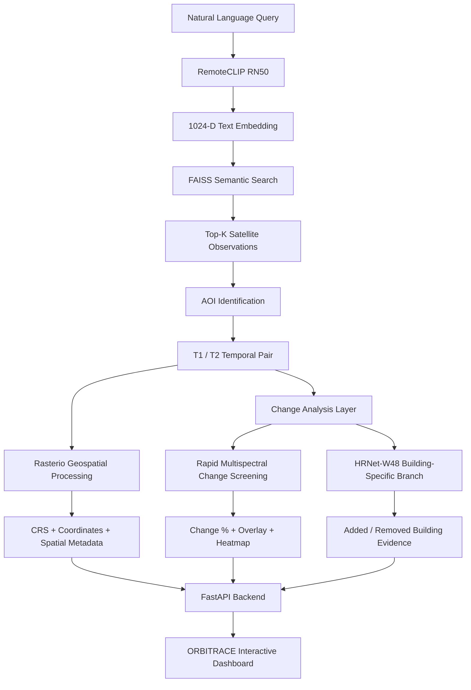

<div align="center">

# 🛰️ ORBITRACE

### Semantic Satellite Retrieval & Multi-Temporal Change Intelligence

**Search the Earth by meaning. Retrieve the right satellite location. Compare time. Detect change. Generate geospatial evidence.**


### Smart India Hackathon 2026

</div>

---

# 🌍 What is ORBITRACE?

**ORBITRACE** is an AI-powered satellite intelligence platform that allows users to search satellite imagery using **natural language** and immediately connect the retrieved location with **multi-temporal change evidence**.

Traditional satellite-image analysis often requires users to manually search:

- geographic coordinates
- satellite tiles
- dates
- scenes
- metadata
- before/after observations

ORBITRACE replaces much of that workflow with a semantic search interface.

A user can simply ask:

> **“Find areas showing dense urban expansion.”**

or

> **“Show satellite regions containing forest with winding roads.”**

ORBITRACE then:

```text
UNDERSTANDS THE QUERY
        ↓
SEARCHES THE SATELLITE ARCHIVE
        ↓
FINDS THE MOST RELEVANT AOI
        ↓
LOCATES TEMPORAL OBSERVATIONS
        ↓
COMPARES T1 AND T2
        ↓
GENERATES CHANGE EVIDENCE
        ↓
RETURNS LOCATION + MAP + METRICS + VISUALS
```

---

# ✨ What the Working System Can Do

| Capability | Status |
|---|---|
| Natural-language satellite search | ✅ Working |
| RemoteCLIP semantic embeddings | ✅ Working |
| FAISS vector retrieval | ✅ Working |
| Top-K satellite ranking | ✅ Working |
| 80 AOI archive | ✅ Working |
| 160 indexed observations | ✅ Working |
| Automatic AOI identification | ✅ Working |
| T1/T2 temporal pairing | ✅ Working |
| GeoTIFF metadata extraction | ✅ Working |
| CRS extraction | ✅ Working |
| Latitude / Longitude extraction | ✅ Working |
| Reverse geocoding | ✅ Working |
| Before / After comparison | ✅ Working |
| Interactive T1/T2 slider | ✅ Working |
| Rapid change screening | ✅ Working |
| Change percentage | ✅ Working |
| Change heatmap | ✅ Working |
| Change overlay | ✅ Working |
| Evidence generation | ✅ Working |
| Regional case section | ✅ Working |
| FastAPI backend | ✅ Working |
| REST API | ✅ Working |
| Web dashboard | ✅ Working |
| Backend health monitoring | ✅ Working |
| HRNet building-change branch | ✅ Validated experimental branch |

---

# ⚡ End-to-End Architecture



---

# 🧠 AI & Intelligence Stack

## 1. RemoteCLIP RN50

ORBITRACE uses **RemoteCLIP RN50** for semantic satellite-image retrieval.

RemoteCLIP maps:

```text
TEXT
+
SATELLITE IMAGERY
```

into a shared semantic embedding space.

Example:

```text
Query:
"urban expansion with dense buildings"

        ↓

RemoteCLIP RN50

        ↓

1024-dimensional text embedding
```

The embedding can then be compared with precomputed satellite-image embeddings.

This allows ORBITRACE to retrieve imagery based on **visual meaning**, rather than filenames or manually assigned tags.

---

# 🔎 2. FAISS Semantic Search

Satellite-image embeddings are indexed inside **FAISS**.

```text
Satellite Images
        ↓
RemoteCLIP
        ↓
Image Embeddings
        ↓
FAISS Index
        ↑
Text Query Embedding
```

When a user searches:

```text
urban expansion with dense buildings
```

ORBITRACE retrieves the most semantically similar observations.

Example output:

```text
Rank #1

AOI:
L15-0487E-1246N_1950_3207_13

Observation:
2018_01

Semantic Score:
0.2829

Coordinates:
36.332826, -94.284668
```

> Semantic score represents **embedding similarity**, not probability or model accuracy.

---

# 🛰️ Satellite Archive

The current working archive contains:

```text
80 PUBLIC AOIs
×
2 TEMPORAL OBSERVATIONS
=
160 SEARCHABLE SATELLITE OBSERVATIONS
```

The archive is based primarily on **SpaceNet-7 multi-temporal satellite imagery**.

Accessible public split used during development:

```text
Training AOIs     : 60
Public Test AOIs  : 20
-----------------------
Total AOIs        : 80
```

Each selected AOI contains two temporal observations used for semantic search and change screening.

---

# ⏳ Multi-Temporal Intelligence

After semantic retrieval, ORBITRACE identifies the corresponding AOI.

Example:

```text
Semantic Search Result
        ↓
AOI ID
        ↓
Temporal Catalog
        ↓
T1 Observation
+
T2 Observation
```

This allows the platform to automatically move from:

```text
SEARCH
```

to:

```text
CHANGE ANALYSIS
```

without requiring the user to manually find matching images.

---

# 🗺️ Geospatial Intelligence

ORBITRACE uses **Rasterio** to extract geographic metadata directly from GeoTIFF imagery.

Supported information includes:

```text
CRS
Affine Transform
Pixel Resolution
Bounds
Latitude
Longitude
AOI Identifier
Observation Date
```

Example:

```json
{
  "aoi_id": "L15-1669E-1160N_6679_3549_13",
  "t1": "2017_07",
  "t2": "2019_09",
  "crs": "EPSG:3857",
  "latitude": 23.3422543,
  "longitude": 113.5327148
}
```

Reverse geocoding can then convert coordinates into human-readable location information.

---

# 🔄 Change Analysis

ORBITRACE contains two different change-analysis paths.

---

## ⚡ Rapid Change Screening

For the expanded 80-AOI archive, ORBITRACE uses a lightweight multispectral temporal-change screening engine.

It compares actual T1/T2 satellite observations and generates:

```text
Changed Pixels
Stable Pixels
Change Percentage
Change Level
Change Overlay
Change Heatmap
```

Example:

```text
Change Percentage : 4.878%
Change Level      : MODERATE
Changed Pixels    : 51,147
Stable Pixels     : 997,429
```

This branch is designed for **general surface-change screening**.

It should not be interpreted as automatically identifying the semantic cause of every change.

---

# 🏗️ HRNet-W48 Building Change Branch

ORBITRACE also contains a separately validated building-specific experimental branch.

Model:

```text
SpaceNet-7 lxastro0
HRNet-W48
```

Frozen configuration:

```text
Image Scale        : 3×
Patch Size         : 512 × 512
Patch Overlap      : None
Building Threshold : 0.35
Minimum Component  : 100 pixels
```

The branch generates:

```text
Building Probability Maps
Persistent Buildings
Added Buildings
Removed Buildings
Change Mask
Change Overlay
Pixel Statistics
```

---

# 📊 HRNet Validation Results

## Development AOI

```text
L15-1669E-1160N_6679_3549_13
```

| Metric | Added Building Detection |
|---|---:|
| Precision | 0.4626 |
| Recall | 0.6137 |
| F1 Score | **0.5276** |
| IoU | **0.3583** |

---

## Separate Unseen AOI

```text
L15-1615E-1206N_6460_3366_13
```

Using the same frozen parameters:

| Metric | Added Building Detection |
|---|---:|
| Precision | 0.4598 |
| Recall | 0.6170 |
| F1 Score | **0.5269** |
| IoU | **0.3577** |

> These metrics represent limited POC validation results, not production-grade accuracy.

---

# 🔬 Example Full Analysis

One validated ORBITRACE pipeline run:

```text
Query:
"forest with winding roads"
```

Retrieved:

```text
AOI:
L15-1669E-1160N_6679_3549_13

Location:
Huangpu District
Guangdong
China

T1:
2017_07

T2:
2019_09
```

Change analysis:

```text
Added Pixels      : 314,855
Removed Pixels    : 141,779
Changed Pixels    : 456,634

Added Change      : 3.336%
Removed Change    : 1.502%
Total Change      : 4.839%
```

Estimated spatial change:

```text
Added Area   ≈ 0.6706 km²
Removed Area ≈ 0.3020 km²
Total Change ≈ 0.9725 km²
```

Interpretation:

```text
URBAN EXPANSION / NEW CONSTRUCTION
NET GROWTH
GROWTH-DOMINANT
```

---

# 🖥️ Interactive Dashboard

The working ORBITRACE frontend includes:

### Search

```text
Natural-language satellite search
Suggested semantic queries
Top-5 retrieval results
Semantic similarity scores
```

### Satellite Archive

```text
80 AOIs
160 observations
Preview imagery
Temporal information
```

### Temporal Analysis

```text
T1 / T2 Before-After Slider
Observation Dates
AOI Information
```

### Change Intelligence

```text
Change Overlay
Change Heatmap
Change Mask
Changed Pixels
Stable Pixels
Change Percentage
Change Level
```

### Geospatial Evidence

```text
Coordinates
Location
AOI Identifier
Map Integration
```

### System Intelligence

```text
Model Stack
Backend Status
Execution Trace
Analysis Mode
Evidence Summary
```

---

# 🇮🇳 Regional Case Intelligence

ORBITRACE also supports dedicated regional cases for more focused analysis.

Regional views can contain:

```text
Before Satellite Image
After Satellite Image
Change Mask
Overlay
Location
Coordinates
Change Interpretation
Evidence
```

These cases allow the system to demonstrate region-specific temporal events while remaining connected to the same overall satellite-intelligence architecture.

---

# 🧭 System Execution Trace

ORBITRACE exposes the major processing stages so the user can understand what happened internally.

Example:

```text
QUERY RECEIVED
      ↓
REMOTECLIP EMBEDDING
      ↓
FAISS SEARCH
      ↓
AOI RETRIEVED
      ↓
TEMPORAL PAIR FOUND
      ↓
CHANGE ANALYSIS
      ↓
GEOSPATIAL METADATA
      ↓
INTERPRETATION
      ↓
FINAL EVIDENCE
```

This makes the platform more explainable than a simple image-search interface.

---

# 🔌 FastAPI Backend

The current backend is implemented with **FastAPI**.

Default local backend:

```text
http://127.0.0.1:8001
```

Core demo endpoints:

```text
GET  /
GET  /api/v1/demo/status
GET  /api/v1/demo/search
POST /api/v1/demo/search
```

Example request:

```text
GET /api/v1/demo/search?q=urban%20expansion%20with%20dense%20buildings&top_k=5
```

The backend handles:

```text
RemoteCLIP Query Encoding
FAISS Search
AOI Retrieval
Metadata Resolution
Temporal Pair Resolution
Change Result Retrieval
Evidence Asset Delivery
```

---

# 📦 Static Evidence Assets

Generated evidence is served through dedicated asset routes.

Examples include:

```text
Satellite Previews
T1 Imagery
T2 Imagery
Change Overlays
Heatmaps
Pipeline Results
Evidence JSON
```

---

# 🏗️ Project Structure

```text
satellite-poc/
│
├── ORBITRACE/
│   │
│   ├── backend/
│   │   ├── demo_api.py
│   │   ├── app.py
│   │   ├── api/
│   │   ├── services/
│   │   ├── semantic_search/
│   │   ├── change_detection/
│   │   └── geospatial/
│   │
│   ├── config/
│   │
│   ├── core/
│   │
│   ├── data/
│   │
│   ├── frontend/
│   │   ├── index.html
│   │   ├── style.css
│   │   ├── script.js
│   │   └── README_CONNECT.txt
│   │
│   ├── models/
│   │
│   ├── outputs/
│   │
│   └── scripts/
│       ├── build_sn7_160_faiss.py
│       ├── download_sn7_80_aoi.py
│       ├── retry_failed_sn7.py
│       ├── test_sn7_semantic_visual.py
│       ├── test_sn7_query_to_pair.py
│       ├── test_full_pipeline.py
│       ├── test_hrnet_local.py
│       └── precompute_rapid_change_all.py
│
├── core/
│   ├── semantic_search.py
│   ├── faiss_index.py
│   ├── geospatial.py
│   ├── pipeline.py
│   └── change_detection*.py
│
├── images/
├── integration_data/
├── dataset/
├── .gitignore
└── README.md
```

---

# 💾 Local Data Layout

Large satellite imagery and generated artifacts are intentionally stored outside the Git repository.

Example development storage:

```text
C:\ORBITRACE_DATA
```

Important working directories include:

```text
C:\ORBITRACE_DATA\
│
├── mini_archive\
├── sn7_80_aoi\
├── sn7_80_previews\
├── faiss\
├── rapid_change_all\
└── pipeline_results\
```

---

# 📚 Semantic Index

Current FAISS index:

```text
160 vectors
1024 dimensions
```

Conceptually:

```text
80 AOIs
×
2 observations
=
160 RemoteCLIP image embeddings
```

The index allows fast nearest-neighbour search from natural-language queries.

---

# 🛠️ Technology Stack

| Layer | Technology |
|---|---|
| Programming Language | Python 3.11 |
| Vision-Language Model | RemoteCLIP RN50 |
| Vector Search | FAISS |
| Building Segmentation | HRNet-W48 |
| Geospatial Processing | Rasterio |
| ML Runtime | PyTorch |
| Image Processing | Pillow |
| Numerical Processing | NumPy |
| Backend | FastAPI |
| ASGI Server | Uvicorn |
| Frontend | HTML / CSS / JavaScript |
| Satellite Dataset | SpaceNet-7 |
| Data Formats | GeoTIFF / PNG / JSON |
| Development Platform | Windows / VS Code |
| Version Control | Git / GitHub |

---

# 🚀 Run ORBITRACE Locally

## 1. Clone

```bash
git clone https://github.com/ingolesamarth2006-rgb/satellite-poc.git
cd satellite-poc
```

---

## 2. Create Environment

```powershell
py -3.11 -m venv .venv
.\.venv\Scripts\Activate.ps1
```

---

## 3. Install Core Dependencies

```powershell
pip install torch torchvision
pip install open-clip-torch
pip install faiss-cpu
pip install rasterio
pip install pillow
pip install numpy
pip install fastapi
pip install uvicorn
```

Additional dependencies may be required depending on which experimental model branch is being executed.

---

# ▶️ Start Backend

From:

```text
satellite-poc
```

run:

```powershell
.\.venv\Scripts\python.exe -m uvicorn ORBITRACE.backend.demo_api:app --host 127.0.0.1 --port 8001
```

Expected:

```text
Backend ready
FAISS vectors: 160
Metadata records: 160
Rapid change results: 80
```

---

# 🌐 Start Frontend

Open another terminal:

```powershell
.\.venv\Scripts\python.exe -m http.server 5501 --directory ".\ORBITRACE\frontend"
```

Then open:

```text
http://127.0.0.1:5501
```

---

# ⚡ One-Command Windows Launch

From the project root:

```powershell
Start-Process powershell -ArgumentList '-NoExit','-Command','cd "C:\Users\samar\OneDrive\Desktop\satellite-poc"; & ".\.venv\Scripts\python.exe" -m uvicorn ORBITRACE.backend.demo_api:app --host 127.0.0.1 --port 8001'; Start-Process powershell -ArgumentList '-NoExit','-Command','cd "C:\Users\samar\OneDrive\Desktop\satellite-poc"; & ".\.venv\Scripts\python.exe" -m http.server 5501 --directory ".\ORBITRACE\frontend"'; Start-Sleep 4; Start-Process "http://127.0.0.1:5501"
```

Change the local path if the repository is stored elsewhere.

---

# 🧪 Example Search

Try:

```text
urban expansion with dense buildings
```

or:

```text
forest with winding roads
```

The system returns ranked satellite observations and allows temporal analysis of the selected AOI.

---

# 🛡️ Technical Integrity

ORBITRACE intentionally separates different kinds of evidence.

### Semantic Score

```text
RemoteCLIP / FAISS similarity
```

It is **not** a classification probability.

### Rapid Change Percentage

Represents the fraction of the analyzed image grid showing significant temporal surface-change signal.

It is **not automatically building growth percentage**.

### HRNet Results

Building-specific claims are only associated with the validated HRNet branch.

### Reliability

Any confidence or evidence score shown in the prototype should be interpreted as a system heuristic unless explicitly calibrated.

---

# ⚠️ Current Technical Boundaries

ORBITRACE is a working **SIH / research prototype**, not yet a production satellite-monitoring service.

Current limitations include:

- archive size is still limited compared with operational satellite platforms
- no dedicated cloud-detection model is currently part of the core pipeline
- no dedicated automatic registration-correction system is currently deployed
- rapid screening detects surface change but does not always determine its semantic cause
- two observations alone cannot always establish long-term persistence
- HRNet validation is based on a limited POC dataset
- large satellite datasets and model weights are not distributed through GitHub

These limitations are intentionally documented to keep the system technically transparent.

---

# 🔮 Next Development Phase

Planned improvements:

```text
Larger India-focused Satellite Archive
        ↓
Sentinel / Copernicus Integration
        ↓
Cloud + Shadow Detection
        ↓
Automatic Registration Quality Checks
        ↓
Multi-Date Temporal Timeline
        ↓
Flood / Water Expansion Intelligence
        ↓
Land-Use Specific Change Models
        ↓
Improved Semantic Ranking
        ↓
Spatial Database
        ↓
GPU Deployment
        ↓
Scalable Cloud Infrastructure
```

---

# 💡 Why ORBITRACE is Different

Most satellite platforms start from:

```text
Coordinates
Date
Satellite
Cloud %
Dataset
```

ORBITRACE starts from:

```text
"What am I looking for?"
```

and attempts to automatically connect:

```text
HUMAN INTENT
      ↓
SATELLITE SEMANTICS
      ↓
LOCATION
      ↓
TIME
      ↓
CHANGE
      ↓
EVIDENCE
```

The combination of:

```text
Natural-Language Search
+
Remote-Sensing Embeddings
+
Vector Retrieval
+
Temporal Pairing
+
Geospatial Processing
+
Change Evidence
```

is the core idea behind ORBITRACE.

---

# 🏆 Smart India Hackathon 2026

ORBITRACE was developed as a **Smart India Hackathon 2026 satellite intelligence prototype**.

The working system demonstrates the complete flow:

```text
USER QUERY
      ↓
REMOTECLIP RN50
      ↓
FAISS
      ↓
TOP-K SATELLITE RESULTS
      ↓
AOI
      ↓
T1 / T2
      ↓
CHANGE ANALYSIS
      ↓
LOCATION + METRICS
      ↓
MAP + OVERLAY + HEATMAP
      ↓
EVIDENCE
```

---

# 🔐 Repository & Data Policy

Large datasets and model artifacts should not be committed directly to GitHub.

Recommended exclusions:

```gitignore
.venv/
__pycache__/
*.pyc

.env
.env.*

*.pt
*.pth
*.ckpt

*.npy
*.tif
*.tiff

external/
outputs/
ORBITRACE/outputs/
```

Never commit:

```text
API keys
Passwords
Access Tokens
Private Credentials
```

---

# 📌 Project Status

```text
RemoteCLIP Semantic Retrieval       ✅ COMPLETE
        ↓
FAISS 160-Observation Index         ✅ COMPLETE
        ↓
80 AOI Satellite Archive            ✅ COMPLETE
        ↓
Geospatial Metadata                 ✅ COMPLETE
        ↓
Automatic T1/T2 Pairing             ✅ COMPLETE
        ↓
Rapid Change Screening              ✅ COMPLETE
        ↓
HRNet Validated Branch              ✅ COMPLETE
        ↓
Unified ORBITRACE Pipeline          ✅ COMPLETE
        ↓
FastAPI Backend                     ✅ COMPLETE
        ↓
Interactive Web Dashboard           ✅ COMPLETE
        ↓
Regional Case Intelligence          ✅ COMPLETE
        ↓
SIH Working Prototype               ✅ READY
```

---

# 📜 License

No open-source license has currently been declared.

Unless a license is added, publicly visible source code should **not be assumed to grant unrestricted reuse, redistribution, or modification rights**.

---

# ⚠️ Disclaimer

ORBITRACE is a research and hackathon prototype.

Its outputs are intended for:

```text
Research
Demonstration
Decision Support
Exploratory Satellite Analysis
```

They should not be treated as authoritative conclusions for:

```text
Emergency Response
Defence Operations
Legal Decisions
Land Ownership
Disaster Certification
```

without additional professional validation.

---

<div align="center">

# 🛰️ ORBITRACE

### Search the Earth by meaning.
### Understand how it changes over time.

**Semantic Retrieval • Temporal Intelligence • Geospatial Evidence**

---

**Built for Smart India Hackathon 2026**

</div>
